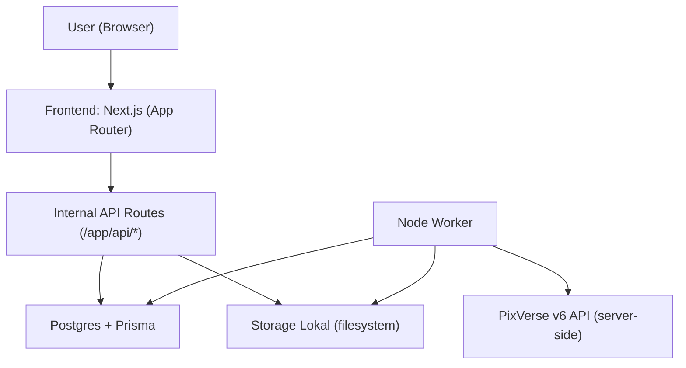
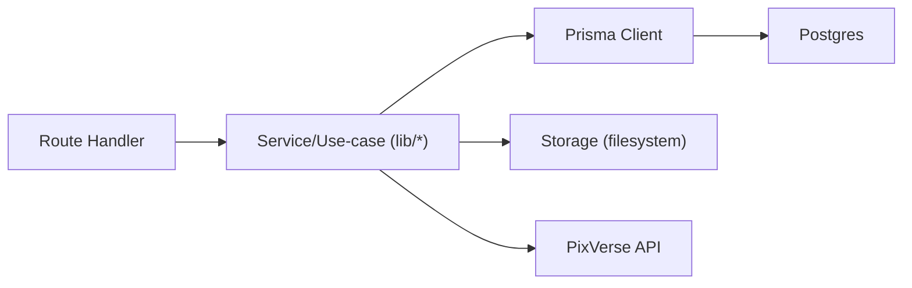
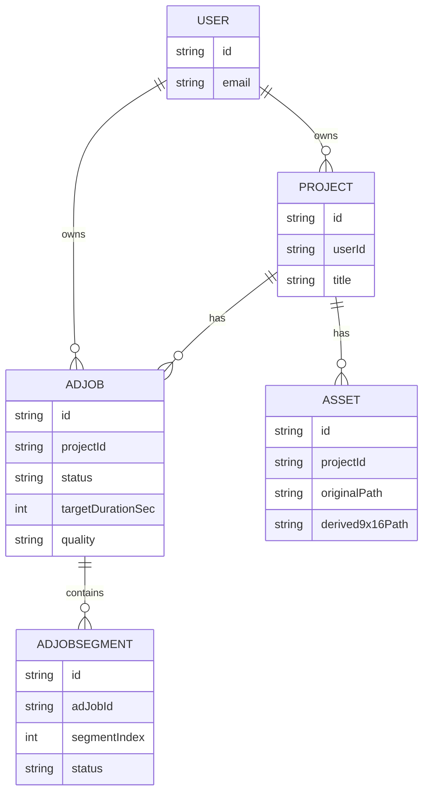

## 1. Desain Arsitektur

## 2. Deskripsi Teknologi
- Frontend: Next.js (App Router) + React + TypeScript
- Backend: Internal API routes di Next.js (server-side)
- Database: Postgres (persistensi) via Prisma
- Worker: proses Node.js terpisah untuk polling dan stitching
- Video stitching: ffmpeg (server-side)
- Storage: filesystem lokal untuk MVP (struktur folder di storage/private/…)

## 3. Definisi Route
| Route | Tujuan |
|-------|--------|
| / | Beranda |
| /projects | Daftar & buat project |
| /projects/[projectId] | Detail project & upload asset |
| /ad-jobs/new | Form pembuatan ad job |
| /ad-jobs/[jobId] | Status ad job & progress segmen |
| /api/projects | Create/list project |
| /api/projects/[projectId]/assets | Upload asset (multipart) |
| /api/template-packs | List template packs (mock) |
| /api/ad-jobs | Create ad job (buat segmen + enqueue task) |
| /api/ad-jobs/[jobId] | Get status ad job |
| /api/ad-jobs/[jobId]/download | Download final.mp4 |

## 4. Definisi API (ringkas)
- POST /api/projects
  - Request: { userId: string, title: string }
  - Response: Project
- GET /api/projects?userId=...
  - Response: Project[]
- POST /api/projects/[projectId]/assets (multipart form-data)
  - Field: userId, file
  - Response: Asset
- GET /api/template-packs
  - Response: TemplatePack[]
- POST /api/ad-jobs
  - Request: userId, projectId, templatePackId, targetDurationSec, quality, params
  - Response: { jobId: string }
- GET /api/ad-jobs/[jobId]
  - Response: AdJob + segments
- GET /api/ad-jobs/[jobId]/download
  - Response: MP4 bytes (Content-Disposition)

## 5. Diagram Arsitektur Server (internal API)

## 6. Model Data (tingkat tinggi)

