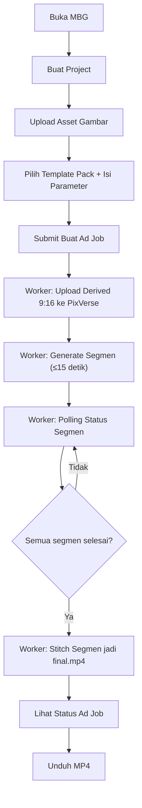

## 1. Ikhtisar Produk
MBG (My Brand Gue) adalah web app untuk membuat video iklan produk vertikal 9:16 berdurasi 30–45 detik dengan membagi menjadi beberapa segmen ≤15 detik, memanggil PixVerse v6, lalu menyambungkan segmen menjadi satu MP4 (tanpa audio) untuk MVP.
- Tujuan: mempercepat pembuatan iklan produk (terutama untuk UMKM/brand kecil) dengan alur yang sederhana dan bisa dipantau statusnya.
- Nilai: mengurangi biaya/skill editing video, memberi output yang konsisten lewat template pack.

## 2. Fitur Inti

### 2.1 Peran Pengguna
| Peran | Metode Registrasi | Izin Inti |
|------|--------------------|----------|
| Pengguna | (MVP) tidak ada auth (mock userId) | Membuat project, upload asset, membuat ad job, melihat status, unduh hasil |

### 2.2 Modul Fitur
1. **Beranda**: ringkasan produk, CTA untuk mulai.
2. **Projects**: daftar project, pembuatan project.
3. **Project Detail**: unggah aset gambar, lihat aset terakhir.
4. **Buat Ad Job**: pilih template pack, isi parameter prompt, target durasi, kualitas.
5. **Status Ad Job**: pantau status segmen, status final, tombol unduh MP4.

### 2.3 Detail Halaman
| Nama Halaman | Nama Modul | Deskripsi Fitur |
|-------------|------------|-----------------|
| Beranda | Hero + CTA | Menjelaskan MBG, tautan ke alur pembuatan |
| Projects | List + Create | Menampilkan daftar project, form buat project |
| Project Detail | Upload Asset | Upload gambar, simpan original + derived 9:16, tampilkan metadata |
| Buat Ad Job | Wizard Form | Pilih template pack, set bahasa/tone/benefit/offer/cta, submit ke API |
| Status Ad Job | Progress + Download | Menampilkan status per segmen, status job, unduh hasil jika selesai |

## 3. Proses Inti
Alur utama: pengguna membuat project → mengunggah aset gambar → memilih template pack dan mengisi parameter iklan → sistem membuat job dan beberapa segmen → worker memproses (upload image, generate video, polling) → sistem menyambung segmen → pengguna mengunduh MP4 final.

## 4. Desain Antarmuka
### 4.1 Gaya Desain
- Warna: dasar netral gelap/terang, aksen kontras untuk CTA (satu warna aksen dominan).
- Tombol: jelas, kontras tinggi, fokus aksesibilitas (hover/focus state).
- Tipografi: hierarki tegas (judul besar, body ringkas) untuk nuansa “tool yang cepat”.
- Layout: desktop-first dengan top navigation sederhana, konten utama terstruktur.

### 4.2 Ringkasan Desain per Halaman
| Nama Halaman | Nama Modul | Elemen UI |
|-------------|------------|----------|
| Beranda | Hero + CTA | Heading, subheading, tombol mulai, penjelasan singkat alur |
| Projects | List + Create | Tabel/list project, input judul, tombol buat |
| Project Detail | Upload Asset | Dropzone / file input, preview, metadata, status upload |
| Buat Ad Job | Wizard Form | Select template pack, input benefits, offer, CTA, quality, duration |
| Status Ad Job | Progress + Download | Timeline/progress, status segmen, link unduh saat done |

### 4.3 Responsivitas
Desktop-first, lalu adaptif untuk mobile (stacking layout, input full-width, target sentuh).
